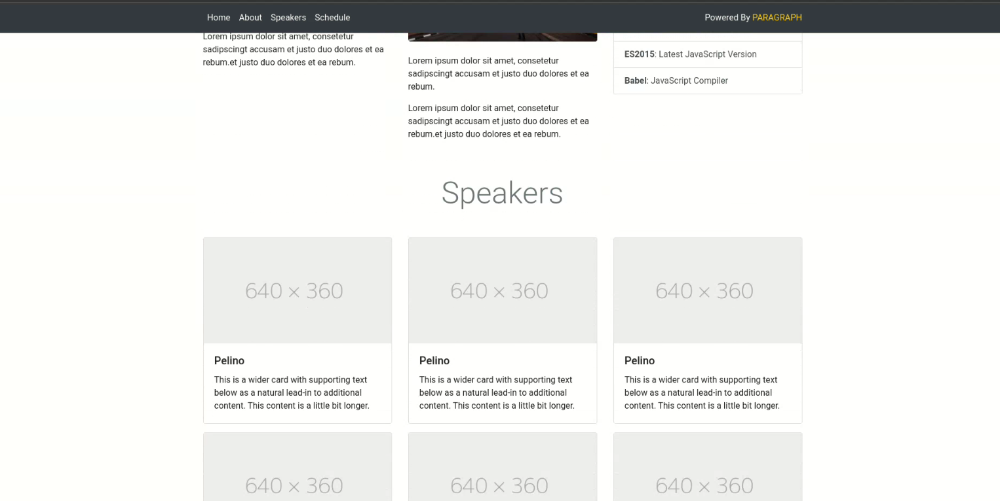
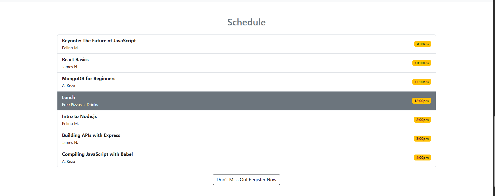

# Full Stack Conf - Bootstrap 5 Project

This is a website for a tech conference called **Full Stack Conf**. I built this using only **Bootstrap 5** and **HTML**. 

---

##  What's on the Page

- A navigation bar (menu)  
- A big heading section with two buttons  
- A pop-up form to register for the event  
- Speaker cards with photos and info  
- A full event schedule  
- A footer with links, a newsletter signup, and more events

---

### Folder Overview
├── assets/ (This contains the images used on the page)
│ ├── James.png
│ ├── Keza.png
│ ├── Pelino.png
│ ├── kigali.jpeg
├── index.html
└── README.md

---

#### How to Open It

1. Download or clone this folder  
2. Open `index.html` in your browser  
3. You can also use **Live Server** if you're using VS Code  
No need to install anything else!

## Screenshot Comparison Table

| Section | Demo Reference  | My Implementation |
|--------|--------------------|----------------------|
| Hero Section |  |  |
| Modal Form |  |  |
                |  |
| Speakers Section |  |  |
| Schedule Section |  |  |
| Footer with Dropup |  |  |
